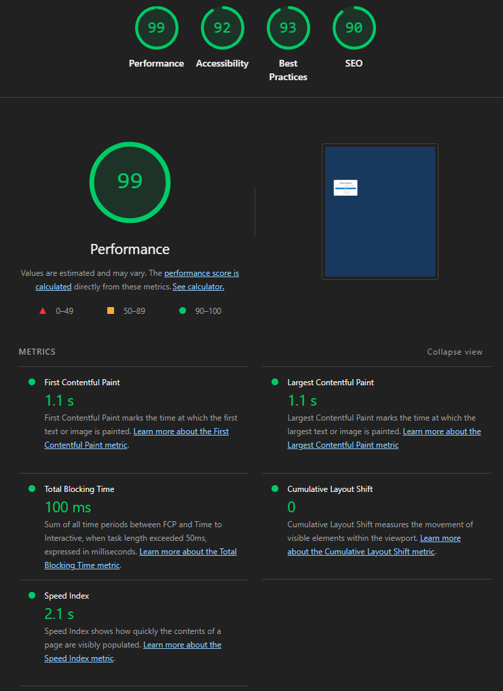

# se_formative
Formative Assignment for Software Engineering Course

## Currency Converter

A simple and responsive web-based currency converter that allows users to convert between multiple currencies using real-time exchange rates.

## Features

- Convert between popular currencies (USD, CAD, EUR, PKR, BDT, INR, etc.)
- Fetches real-time exchange rates from a public API
- Responsive and modern UI
- Swap currencies with a single click
- Conversion history (last 5 conversions)
- User-friendly error handling

## Demo

[Live Demo](http://127.0.0.1:5500/currency_converter.html)

## Development Board


## Getting Started

### Prerequisites

- A modern web browser
- (Optional) [Node.js](https://nodejs.org/) and [Git](https://git-scm.com/) for local development

### Installation

1.**Clone the repository:**
   ```
   git clone https://github.com/yourusername/currency-converter.git
   cd currency-converter
   ```
2. **Open `currency_converter.html` in your browser**  
   Or use a local server for development.

### File Structure

```
currency-converter/
├── currency_converter.html
├── convertor_style.css
├── convertor_script.js
├── logo.png
└── README.md
```
### Usage

1. Enter the amount you want to convert.
2. Select the source and target currencies.
3. Click **Convert** to see the result.
4. Use the swap button to quickly switch currencies.

### Deployment

This project can be deployed for free using [GitHub Pages](https://pages.github.com/):

- Push your code to GitHub.
- Enable GitHub Pages in the repository settings.
- Your site will be live at `https://yourusername.github.io/currency-converter/`.

## Testing

Below are the results displayed by using Google Lighthouse.



