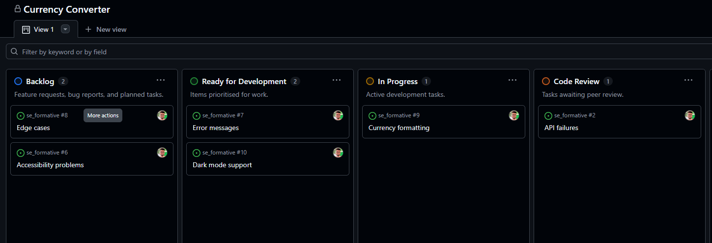
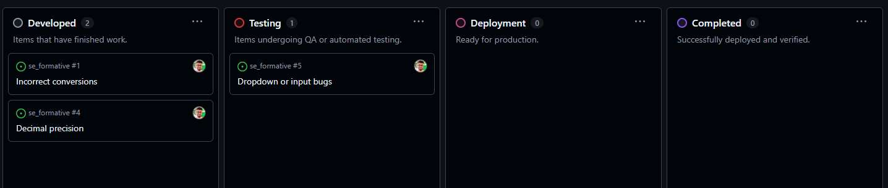

# se_formative
Formative Assignment for Software Engineering Course

## Currency Converter

A simple and responsive web-based currency converter that allows users to convert between multiple currencies using real-time exchange rates.

## Features

- Convert between popular currencies (USD, CAD, EUR, PKR, BDT, INR, etc.)
- Fetches real-time exchange rates from a public API
- Responsive and modern UI
- Swap currencies with a single click
- Conversion history (last 5 conversions)
- User-friendly error handling

## Demo

[Live Demo](http://127.0.0.1:5500/currency_converter.html)

## Development Board

